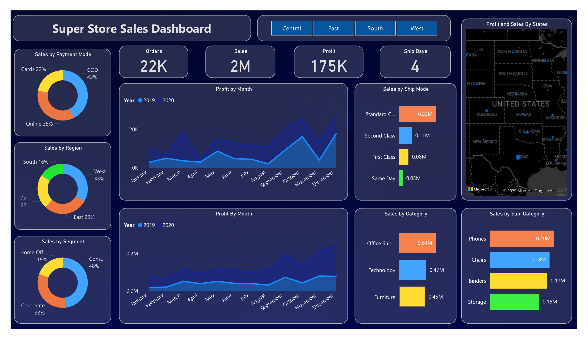

<h1># 📊 Super Store Sales Dashboard - Power BI Project</h1>  

,  

## 📁 Project Overview 

This Power BI project provides deep insights into the sales performance of a fictional Super Store across various dimensions like time, product categories, geography, and customer segments. The dashboard helps visualize trends, identify top-performing regions/products, and forecast future sales based on historical data. 

---

## 📂 Files Included 

- [`Super_Store_Sales_DashBoard - Akash Kumar Rajak.pbix`](./Super_Store_Sales_DashBoard%20-%20Akash%20Kumar%20Rajak.pbix): The complete Power BI project file. 
- [`SuperStore_Sales_Dataset.csv`](./SuperStore_Sales_Dataset.csv): The dataset used to create this dashboard. 
- [`Super_Store_Sales_DashBoard - Akash Kumar Rajak.pdf`](./Super_Store_Sales_DashBoard%20-%20Akash%20Kumar%20Rajak.pdf): PDF preview of the dashboard. 
- [`dashboard_preview.png`](./dashboard_preview.png),(./dashboard_forecast_preview.png): Screenshot of the dashboard for quick preview. 

---

## 📈 Key Insights & Visuals 

- **Sales by Category and Sub-Category** 
- **Sales and Profit Trends over Months (2019 & 2020)** 
- **Profit by State & Region** 
- **Sales Forecasting using historical trends** 
- **Sales by Customer Segment & Payment Mode** 
- **Ship Mode analysis to understand logistics impact** 

---

## 🛠️ Tools Used 

- **Power BI Desktop** 
- Microsoft Excel (for data cleaning and exploration) 
- Data Source: Sample Superstore Sales Dataset 

---

## 📌 How to Use 

1. Clone or download this repo. 
2. Open the `.pbix` file using **Power BI Desktop**. 
3. Make sure to enable visuals and check that the dataset is loaded correctly. 
4. Explore, filter, or customize the dashboard to your needs. 

---

## 🙋‍♂️ About Me 

👋 Hi, I'm **Akash Kumar Rajak**, a Power BI and analytics enthusiast currently pursuing B.Tech at **Delhi Technological University**. 
📬 Let's connect on [LinkedIn](https://www.linkedin.com/in/akash-kumar-rajak/) *(replace this with your actual link if different)* 

---

## ⭐ Give it a Star! 

If you liked the project, please ⭐ this repo and share it with others!
